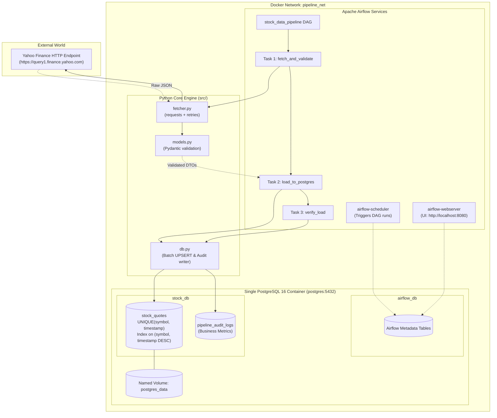
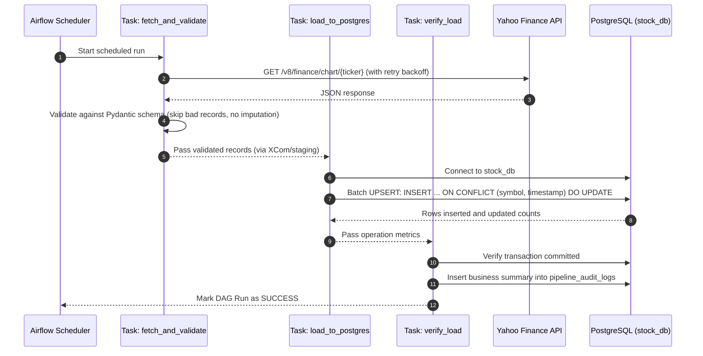

# QuantiFlow: Architectural Deep Dive & Knowledge Base
**Engineered by Anirudh Chhabra** ([@AnirudhChhabra54](https://github.com/AnirudhChhabra54))

---

## 1. Executive Summary & Design Goals

### 1.1 Context
QuantiFlow is a production-grade financial data pipeline built with **Apache Airflow**, direct **HTTP requests**, **Pydantic v2 data contracts**, and **PostgreSQL**.

#### Core Objectives:
1. **Fetch Data**: Retrieve JSON stock market data from a free financial API (Yahoo Finance) via Python's `requests` library on a scheduled basis (hourly or daily).
2. **Process and Store**: Parse JSON payloads, validate records with strict data contracts (Pydantic), and update an existing PostgreSQL database table using idempotent UPSERTs.
3. **Ensure Robustness**: Implement two-tier resilience (HTTP exponential backoff + Airflow task retries) and defensive error handling to gracefully handle missing market data, holidays, and API throttling.
4. **Single-Command Containerization**: Package the entire system using **Docker Compose** so that an evaluator can spin up PostgreSQL and Apache Airflow with a single command.

#### Required Deliverables:
- [`docker-compose.yml`](file:///Users/anirudhchhabra/Downloads/8Byte/docker-compose.yml): Multi-container orchestration (Postgres, Airflow Init, Airflow Webserver, Airflow Scheduler).
- [`Dockerfile`](file:///Users/anirudhchhabra/Downloads/8Byte/Dockerfile): Extended Airflow image packaging required Python dependencies.
- [`dags/stock_pipeline_dag.py`](file:///Users/anirudhchhabra/Downloads/8Byte/dags/stock_pipeline_dag.py): Clean 3-task Airflow DAG (`fetch_and_validate` $\rightarrow$ `load_to_postgres` $\rightarrow$ `verify_load`).
- [`src/fetcher.py`](file:///Users/anirudhchhabra/Downloads/8Byte/src/fetcher.py): Pure `requests`-based extraction engine with retry adapters.
- [`src/models.py`](file:///Users/anirudhchhabra/Downloads/8Byte/src/models.py): Pydantic validation enforcing data integrity without artificial price imputation.
- [`src/db.py`](file:///Users/anirudhchhabra/Downloads/8Byte/src/db.py): PostgreSQL persistence layer with parameterized batch UPSERTs and audit tracking.
- [`README.md`](file:///Users/anirudhchhabra/Downloads/8Byte/README.md): Comprehensive setup, execution, architecture, and verification guide.
- [`tests/`](file:///Users/anirudhchhabra/Downloads/8Byte/tests/): Pytest test suite covering fetcher, models, and database UPSERT logic.

---

## 2. Strategic Engineering Choices

### 2.1 The Two-Tier Resilience Strategy
We clearly distinguish between two layers of failure recovery:

1. **HTTP Layer (In-Memory, Transient)**:
   - Catches socket timeouts, rate limits (HTTP 429), and temporary server glitches (HTTP 500, 502, 503, 504).
   - Handled immediately inside `src/fetcher.py` using `urllib3.util.Retry` with exponential backoff (factors: 1s, 2s, 4s; max 3 retries) and strict socket timeouts (`timeout=(10, 30)`).
2. **Airflow Task Layer (Persistent, Process-Level)**:
   - Catches sustained outages, prolonged API downtime, or temporary container restarts.
   - Configured in the DAG `default_args` with `retries=2` and `retry_delay=timedelta(minutes=2)`.
   - Prevents hammering external APIs while giving the infrastructure time to recover.

### 2.2 Strict Data Integrity: Why We Do NOT Impute Missing Prices
In many generic data pipelines, missing numbers are filled with means or forward-filled. In **financial engineering, this is catastrophic**:
- An imputed stock price of $150.00 during a missing bar creates false volatility, corrupts risk models, and invalidates trading analytics.
- **Our Policy**: If critical fields (`open`, `high`, `low`, `close`) are missing or invalid, the record is flagged, logged with an explicit warning, and discarded.
- **Market Closures**: Stock markets close on weekends, holidays, and after-hours. An empty response during a market closure is a **normal state**, not a pipeline crash. Our validation treats normal market closures gracefully.

### 2.3 Idempotency: The Core of Reliable Data Engineering
A data pipeline is idempotent if running it once or ten times produces the exact same database state:
```sql
INSERT INTO stock_quotes (symbol, timestamp, open_price, high_price, low_price, close_price, volume)
VALUES (%s, %s, %s, %s, %s, %s, %s)
ON CONFLICT (symbol, timestamp) 
DO UPDATE SET
    open_price = EXCLUDED.open_price,
    high_price = EXCLUDED.high_price,
    low_price = EXCLUDED.low_price,
    close_price = EXCLUDED.close_price,
    volume = EXCLUDED.volume,
    updated_at = CURRENT_TIMESTAMP;
```
If an Airflow task retries or an analyst backfills historical dates, existing rows are updated in place with zero duplicate records created.

---

## 3. Technology Stack Rationale

| Component | Choice | Justification |
| :--- | :--- | :--- |
| **Orchestrator** | **Apache Airflow 2.8+** | Enterprise standard; powers orchestration at major tech and finance companies. Rich UI, dependency graphing, and retry mechanisms. |
| **Database** | **PostgreSQL 16** | Robust relational database. Single container logically partitioned into `airflow_db` (internal metadata) and `stock_db` (application tables). |
| **Data Ingestion** | **Python `requests`** | Direct HTTP requests to Yahoo Finance's public chart API (`/v8/finance/chart/{symbol}`). Complies directly with the prompt without third-party wrapper dependencies. |
| **Data Contracts** | **Pydantic v2** | Enforces type safety, timestamp normalization to UTC, positive price boundaries, and logical price invariants (`high >= low`). |
| **Persistence Layer**| **`psycopg2-binary`** | High-performance PostgreSQL driver using parameterized SQL and `execute_values` for atomic batch transactions. |
| **Testing** | **`pytest`** | Automated testing with mocked JSON fixtures to test network failures, corrupted payloads, and DB UPSERTs without hitting live APIs. |

---

## 4. End-to-End System Architecture



---

## 5. Clean 3-Task Airflow DAG Workflow

Rather than fragmenting the pipeline with superficial tasks (e.g. an extra health-check ping that wastes API quota), our DAG has 3 distinct, well-bounded tasks:



---

## 6. Database Schema Design

### 6.1 `stock_quotes` Table
Designed specifically for high-throughput time-series financial analysis:
```sql
CREATE TABLE IF NOT EXISTS stock_quotes (
    id SERIAL PRIMARY KEY,
    symbol VARCHAR(10) NOT NULL,
    timestamp TIMESTAMPTZ NOT NULL,
    open_price NUMERIC(12, 4) NOT NULL,
    high_price NUMERIC(12, 4) NOT NULL,
    low_price NUMERIC(12, 4) NOT NULL,
    close_price NUMERIC(12, 4) NOT NULL,
    volume BIGINT NOT NULL,
    created_at TIMESTAMPTZ DEFAULT CURRENT_TIMESTAMP,
    updated_at TIMESTAMPTZ DEFAULT CURRENT_TIMESTAMP,
    CONSTRAINT uq_symbol_timestamp UNIQUE (symbol, timestamp)
);

CREATE INDEX IF NOT EXISTS idx_stock_quotes_symbol_time 
ON stock_quotes (symbol, timestamp DESC);
```

### 6.2 `pipeline_audit_logs` Table
Captures business-level ingestion metrics for observability:
```sql
CREATE TABLE IF NOT EXISTS pipeline_audit_logs (
    id SERIAL PRIMARY KEY,
    run_id VARCHAR(100) NOT NULL,
    started_at TIMESTAMPTZ NOT NULL,
    finished_at TIMESTAMPTZ,
    status VARCHAR(20) NOT NULL,       -- 'SUCCESS', 'PARTIAL', 'FAILED'
    tickers_processed INT DEFAULT 0,
    records_fetched INT DEFAULT 0,
    records_inserted INT DEFAULT 0,
    records_updated INT DEFAULT 0,
    records_rejected INT DEFAULT 0,
    error_message TEXT
);
```

---

## 7. Testing Strategy (`pytest`)

Our automated test suite validates each layer in complete isolation:

- **`tests/test_fetcher.py`**:
  - Valid response parsing with real JSON fixtures.
  - HTTP 429 response: confirms retry backoff triggers without unhandled crashes.
  - HTTP 500 response: confirms retry policy.
  - Network timeout: confirms socket timeout handling.
- **`tests/test_models.py`**:
  - Valid record: passes schema and sets UTC timestamp.
  - Missing close price: record rejected (no imputation).
  - Negative price or volume: validation error raised.
  - Inverted bounds (`high < low`): validation error raised.
- **`tests/test_db.py`**:
  - Initial batch insert: verifies correct row count inserted.
  - Idempotent re-run: re-inserting identical data updates rows and creates **zero duplicate records**.
  - Audit log write: confirms audit metrics table updates properly.

---

## 8. Step-by-Step Verification Guide for Evaluators

```bash
# 1. Clone repo and enter directory
cd 8Byte

# 2. Copy environment template
cp .env.example .env

# 3. Spin up the entire stack with a single command
docker compose up -d --build

# 4. Confirm all containers are healthy
docker compose ps

# 5. Access the Airflow UI
# Open http://localhost:8080 (Username: admin, Password: admin_password)

# 6. Trigger the DAG manually via CLI or UI
docker compose exec airflow-webserver airflow dags trigger stock_data_pipeline

# 7. Verify stock records inside PostgreSQL
docker compose exec postgres psql -U postgres -d stock_db -c \
  "SELECT symbol, timestamp, open_price, close_price, volume FROM stock_quotes ORDER BY timestamp DESC LIMIT 5;"

# 8. Verify Idempotency (Run the DAG again and confirm row count does not duplicate)
docker compose exec airflow-webserver airflow dags trigger stock_data_pipeline

# 9. Inspect pipeline audit log metrics
docker compose exec postgres psql -U postgres -d stock_db -c \
  "SELECT run_id, status, records_fetched, records_inserted, records_updated, records_rejected FROM pipeline_audit_logs ORDER BY id DESC LIMIT 2;"

# 10. Run automated tests
pytest tests/ -v
```
