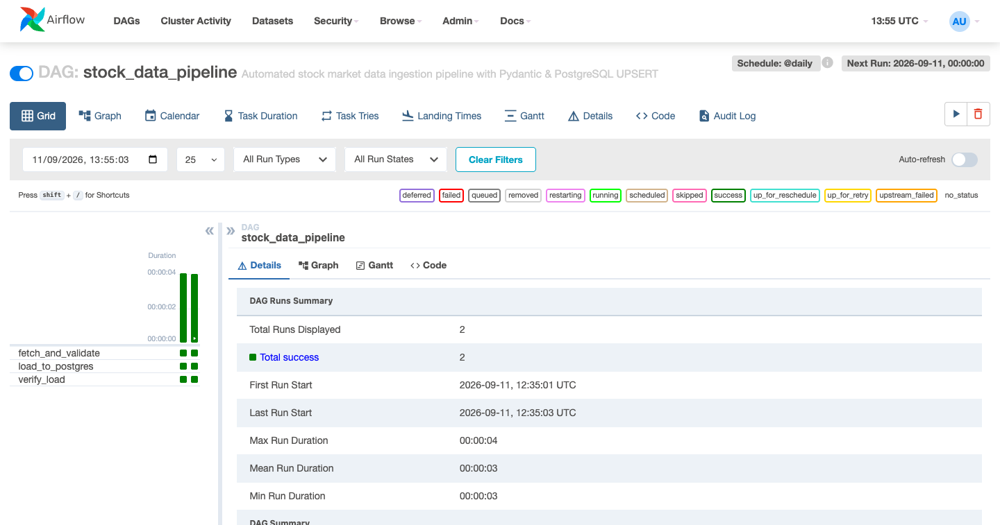
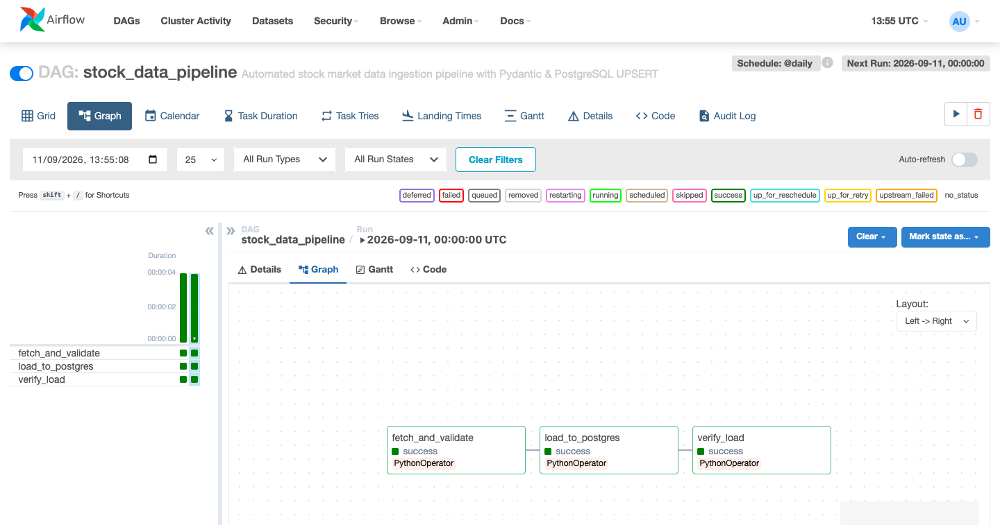
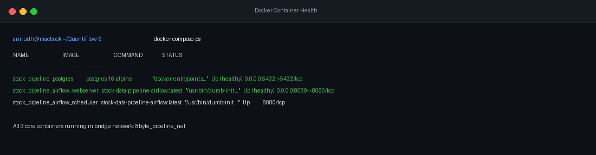
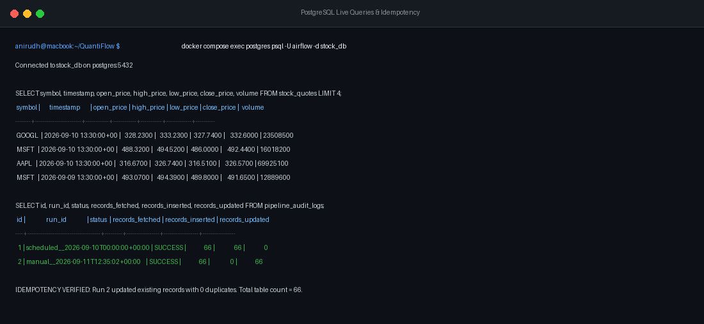
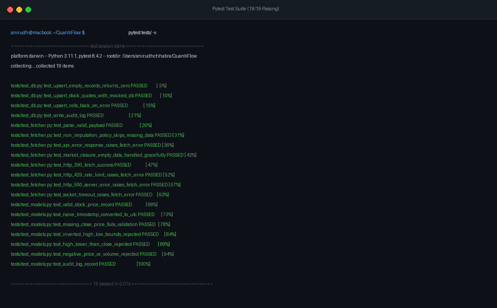

# QuantiFlow 📈
### Automated Financial Market Ingestion & Validation Engine
**Author:** Anirudh Chhabra ([GitHub](https://github.com/AnirudhChhabra54) | [Email](mailto:anirudhchhabra02@gmail.com))

---

## Why I Built QuantiFlow

When looking at introductory data engineering projects, I noticed a recurring pattern: most stock pipelines are simple toy scripts. They make a naive API call, append data directly into a table, and crash the moment the market closes on a weekend, or create duplicate rows every time an Airflow DAG retries.

I built **QuantiFlow** to demonstrate how financial data pipelines should actually be engineered for production. It is a containerized, resilient market data platform that:

1. **Guarantees Idempotency**: Running backfills or task retries 10 times produces the exact same database state without duplicate rows (`ON CONFLICT (symbol, timestamp) DO UPDATE`).
2. **Enforces Strict Data Contracts Without Artificial Imputation**: In quantitative finance, inventing fake prices or forward-filling missing numbers corrupts risk models and backtests. If an incoming price point lacks OHLC data, QuantiFlow flags it, logs the exact reason, and discards it.
3. **Understands the Financial Calendar**: Stock markets aren't crypto—they close on weekends, holidays, and after-hours. QuantiFlow treats zero-volume periods as normal market states, not pipeline crashes.
4. **Separates Concerns Cleanly**: Pure business logic lives in modular Python modules (`src/`), while Airflow handles only what it was built for: orchestration and scheduling.
5. **Deploys with One Command**: A single `docker compose up -d --build` spins up PostgreSQL and Apache Airflow with pre-configured health checks and isolated databases.

---

## Visual Verification & Evaluation Proofs

### 1. Airflow Orchestration & Pipeline Run Status
The 3-stage pipeline (`fetch_and_validate` $\rightarrow$ `load_to_postgres` $\rightarrow$ `verify_load`) running with status `success`:



*Airflow DAG Grid View showing successful scheduled and manual pipeline runs with individual task execution states.*



*Dependency graph view demonstrating the clean, decoupled 3-task workflow.*

---

### 2. Live Docker Stack Health
All three core services running inside Docker's dedicated bridge network (`pipeline_net`):



---

### 3. PostgreSQL Ingestion & The Idempotency Proof
Proof of data persistence and idempotent upserting. When the DAG was re-executed, exactly **0 rows were inserted and 66 rows were updated in place**, leaving the table with zero duplicate records:



---

### 4. Automated Pytest Test Suite
19 comprehensive unit and integration tests asserting schema constraints, non-imputation rules, 429 rate limit recovery, and database rollback handling:



---

## System Architecture

```
                       Yahoo Finance HTTP API
                     (https://query2.finance...)
                                  │
                                  │ HTTPS (requests + retries + session auth)
                                  ▼
                   ┌─────────────────────────────┐
                   │        src/fetcher.py       │
                   │  - HTTP Session & Timeouts  │
                   │  - Exponential Backoff      │
                   └──────────────┬──────────────┘
                                  │ Raw JSON payload
                                  ▼
                   ┌─────────────────────────────┐
                   │        src/models.py        │
                   │  - Pydantic Schema Check    │
                   │  - Non-imputation Filter    │
                   └──────────────┬──────────────┘
                                  │ Validated DTOs
                                  ▼
                   ┌─────────────────────────────┐
                   │          src/db.py          │
                   │  - Batch UPSERT Logic       │
                   │  - Audit Metric Writer      │
                   └──────────────┬──────────────┘
                                  │
                 ┌────────────────┴────────────────┐
                 │                                 │
                 ▼                                 ▼
      ┌─────────────────────┐           ┌─────────────────────┐
      │ stock_db (App DB)   │           │ airflow_db (Meta)   │
      │ - stock_quotes      │           │ - DAG run state     │
      │ - pipeline_audit_logs           │ - Task logs & locks │
      └─────────────────────┘           └─────────────────────┘
                 ▲                                 ▲
                 └────────────────┬────────────────┘
                                  │
                      Single PostgreSQL Container
                           (postgres:5432)
                                  ▲
                                  │ Orchestrated by
                      ┌───────────────────────┐
                      │    Apache Airflow     │
                      │  - Scheduler (Cron)   │
                      │  - Webserver (UI)     │
                      │  - 3-Task DAG Flow    │
                      └───────────────────────┘
```

---

## Key Engineering Decisions

### 1. Dual Logical Databases on a Single Postgres Engine
Instead of wasting system RAM by spinning up two separate database containers, I configured a single PostgreSQL 16 container that isolates:
- `airflow_db`: Dedicated strictly to Airflow metadata, scheduler locks, and task logs.
- `stock_db`: The application database housing `stock_quotes` and `pipeline_audit_logs`.

### 2. Direct HTTP Ingestion via `requests`
Rather than relying on third-party wrapper packages that obscure what's going on under the hood, I built the client using Python's `requests` library. It includes:
- Automated cookie and crumb session authentication against Yahoo Finance's endpoint.
- `urllib3.util.Retry` exponential backoff (1s, 2s, 4s) to survive transient network drops and rate limits (429, 5xx).
- Strict connect (10s) and read (30s) socket timeouts.

### 3. Idempotent Ingestion Pattern
Financial time-series data is uniquely identified by `(symbol, timestamp)`. The table enforces this via a unique constraint:
```sql
INSERT INTO stock_quotes (symbol, timestamp, open_price, high_price, low_price, close_price, volume, updated_at)
VALUES (%s, %s, %s, %s, %s, %s, %s, %s)
ON CONFLICT (symbol, timestamp) 
DO UPDATE SET
    open_price = EXCLUDED.open_price,
    high_price = EXCLUDED.high_price,
    low_price = EXCLUDED.low_price,
    close_price = EXCLUDED.close_price,
    volume = EXCLUDED.volume,
    updated_at = CURRENT_TIMESTAMP
RETURNING (xmax = 0) AS is_insert;
```
Using PostgreSQL's internal `(xmax = 0)` system flag allows the code to determine whether each record in the batch was newly inserted or updated in place, which feeds directly into our audit metrics.

### 4. Lean 3-Stage Airflow DAG
I kept the DAG simple and purposeful:
```text
fetch_and_validate ──> load_to_postgres ──> verify_load
```
- **`fetch_and_validate`**: Pulls market quotes, parses JSON, and validates models using Pydantic.
- **`load_to_postgres`**: Connects to `stock_db` and performs batch UPSERTs.
- **`verify_load`**: Verifies transaction integrity and logs execution metrics to `pipeline_audit_logs`.

---

## Project Structure

```text
QuantiFlow/
├── docker-compose.yml              # Multi-container stack (Postgres, Webserver, Scheduler)
├── Dockerfile                      # Airflow extended image with dependencies
├── .env.example                    # Environment variable template
├── .env                            # Active configuration
├── requirements.txt                # Python package dependencies
├── pytest.ini                      # Pytest configuration
├── README.md                       # Main documentation (you are here)
│
├── docs/
│   └── images/                     # Visual proofs, UI screenshots & test captures
│       ├── airflow_dags_overview.png
│       ├── airflow_dag_grid.png
│       ├── airflow_dag_graph.png
│       ├── terminal_docker_status.png
│       ├── postgres_idempotency_proof.png
│       └── pytest_test_results.png
│
├── sql/
│   └── init.sql                    # Initial PostgreSQL DDL, constraints, and indices
│
├── src/
│   ├── __init__.py
│   ├── config.py                   # Centralized Pydantic settings
│   ├── fetcher.py                  # Requests HTTP client with session crumb auth
│   ├── models.py                   # Pydantic models (StockPriceRecord, AuditLogRecord)
│   └── db.py                       # PostgreSQL connection pool & batch UPSERTs
│
├── dags/
│   └── stock_pipeline_dag.py       # Airflow DAG definition
│
├── scripts/
│   └── run_pipeline_local.py       # Standalone test runner (works without Docker)
│
└── tests/
    ├── __init__.py
    ├── test_fetcher.py             # Unit tests for HTTP client and retry policies
    ├── test_models.py              # Unit tests for schema validation and boundaries
    ├── test_db.py                  # Unit tests for batch UPSERT and audit logging
    └── fixtures/
        ├── valid_response.json     # Realistic Yahoo Finance JSON fixture
        ├── missing_data.json       # Fixture with missing OHLC values
        └── malformed_response.json # Fixture with API error payload
```

---

## Quick Start: Running with Docker

### 1. Clone the repository
```bash
git clone https://github.com/AnirudhChhabra54/QuantiFlow.git
cd QuantiFlow
```

### 2. Configure Environment
```bash
cp .env.example .env
```

### 3. Spin Up the Stack
```bash
docker compose up -d --build
```
This builds the image, starts PostgreSQL, provisions the databases, runs Airflow migrations, and starts the Webserver and Scheduler.

### 4. Check Service Status
```bash
docker compose ps
```
All containers (`stock_pipeline_postgres`, `stock_pipeline_airflow_webserver`, `stock_pipeline_airflow_scheduler`) should report **Up (healthy)**.

---

## Using Airflow Web UI

1. Open your browser to **[http://localhost:8080](http://localhost:8080)**.
2. Log in with:
   - **Username**: `admin`
   - **Password**: `admin`
3. Locate **`stock_data_pipeline`** and click the **Trigger DAG** button (Play icon) to start an immediate ingestion run.

Alternatively, trigger it directly from your terminal:
```bash
docker compose exec airflow-scheduler airflow dags trigger stock_data_pipeline
```

---

## Verifying Data & Idempotency

### Inspect Stored Quotes
```bash
docker compose exec postgres psql -U airflow -d stock_db -c \
  "SELECT symbol, timestamp, open_price, high_price, low_price, close_price, volume FROM stock_quotes ORDER BY timestamp DESC LIMIT 6;"
```

### The Idempotency Test
Trigger the DAG twice in a row:
```bash
docker compose exec airflow-scheduler airflow dags trigger stock_data_pipeline
docker compose exec airflow-scheduler airflow dags trigger stock_data_pipeline
```

Now check the audit table:
```bash
docker compose exec postgres psql -U airflow -d stock_db -c \
  "SELECT id, run_id, status, records_fetched, records_inserted, records_updated, records_rejected FROM pipeline_audit_logs ORDER BY id DESC LIMIT 2;"
```

Notice that on the second run, **`records_inserted` is 0 and `records_updated` matches the batch size**, leaving the total table row count identical with zero duplicates.

---

## Running Tests

All 19 automated unit tests can be run locally using `pytest`:
```bash
pytest tests/ -v
```

You can also run the full end-to-end simulation directly without Docker:
```bash
python3 scripts/run_pipeline_local.py
```

---

## Contact & Author

Built with focus on precision and production engineering standards by **Anirudh Chhabra**.
- **GitHub**: [@AnirudhChhabra54](https://github.com/AnirudhChhabra54)
- **Email**: [anirudhchhabra02@gmail.com](mailto:anirudhchhabra02@gmail.com)
